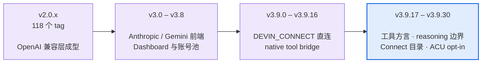

# Changelog

  <a href="#最近的版本">最近的版本</a> ·
  <a href="docs/releases/">全部 181 份发布说明</a> ·
  <a href="README.md">← 主 README</a>

> **这份文件是索引,不是权威。** 每个版本的完整说明在
> [`docs/releases/`](docs/releases/) 下,一版一份 —— 那里才写清了影响面、门禁数字和
> 判据。下面每条是从对应那份文件的第一段机械提取的,**只够你判断"这版要不要看"**。
>
> 版本号遵循 [语义化版本](https://semver.org/lang/zh-CN/)。本项目的实践是:
> **协议兼容性破坏才升 minor**,新增默认关的开关、修缺陷、补测试都是 patch ——
> 所以 patch 号跳得很快,而且 patch 里可能有很重的内容(例如 v3.9.21 是 50 个文件、
> 11 条客户端可见缺陷)。

## 版本节奏

| | |
|---|---|
| 发布说明 | **181** 份,v2.0.6 → v3.9.30 |
| git tag | 192 个 |
| 当前 | **v3.9.30**(2026-09-04) |
| 运行时依赖 | **0** —— 从第一个版本保持到现在 |

## 最近的版本

下面是 3.9.x 全系。更早的版本请直接翻 [`docs/releases/`](docs/releases/)。

### [v3.9.30](docs/releases/RELEASE_NOTES_3.9.30.md) · 2026-09-04

`/v1/models` 列出 glm-5.2 而不是被 glm-5.1 别名挡住。精确 overlay，不是按前缀排序。ACU `^22` 仍默认关。

### [v3.9.29](docs/releases/RELEASE_NOTES_3.9.29.md) · 2026-08-28

Dashboard 401 不再刷空 stats 表；login/OTP 先脱敏再截断。OTA 才能吃到 `09bde39` 同类 401 空表。ACU `^22` 仍默认关。

### [v3.9.28](docs/releases/RELEASE_NOTES_3.9.28.md) · 2026-08-23

旱灾闸放行 Pro 上不吃周配额的 `swe-1-7` / `glm-5-2`（#258）。不扩免费账号 entitlement。ACU `^22` 仍默认关。

### [v3.9.27](docs/releases/RELEASE_NOTES_3.9.27.md) · 2026-08-22

API Key 框同样分类（#257）；401 不再刷空表；RegisterUser 先脱敏再截断。ACU `^22` 仍默认关。

### [v3.9.26](docs/releases/RELEASE_NOTES_3.9.26.md) · 2026-08-21

贴 auth-token「Add failed」、列表看起来空（#257）。session / show-auth-token URL 走对路；401 不再吞成 Add failed。ACU `^22` 仍默认关。

### [v3.9.25](docs/releases/RELEASE_NOTES_3.9.25.md) · 2026-08-21

非流式挂断拆上游（messages / Gemini / Responses）、新安装 `DEFAULT_MODEL=claude-sonnet-4.6`、fail-closed 文档对齐。ACU `^22` 仍默认关。

### [v3.9.24](docs/releases/RELEASE_NOTES_3.9.24.md) · 2026-08-20

Cascade 元数据门、Connect 目录按账号同步、OpenAI 兼容补全(logprobs 400 / completions / 稳定 created)、ACU 解码 opt-in(默认不开 `^22`)。

### [v3.9.23](docs/releases/RELEASE_NOTES_3.9.23.md) · 2026-08-17

SWE-1.7 原生视觉、按账号刷新的在线模型目录、Claude Code system 消息兼容，以及 OTA 更新目标修正。

### [v3.9.22](docs/releases/RELEASE_NOTES_v3.9.22.md) · 2026-08-16

OTA 自更新三件套（tag 门禁 + 失败回滚 + UI）+ 工具族三个已知缺陷。文件名带 `v` 前缀，是历史拼名，不是新版本。

### [v3.9.21](docs/releases/RELEASE_NOTES_3.9.21.md) · 2026-08-08

一份 16 条的外部审计清单,作者明确说明**自己没有验证过任何一条**。逐条裁定后: 11 条修掉,3 条判为"真实但不值得修"并写了理由,2 条本来就已覆盖。**其中 4 条报告把自己的成因说错了** —— 下面按修正后的成因描述。

### [v3.9.20](docs/releases/RELEASE_NOTES_3.9.20.md) · 2026-08-06

Gemini 客户端在上游返回**畸形工具参数**时,拿到的是一个参数全空的工具调用 —— 而日志里什么都没有。这一版修掉它。

### [v3.9.19](docs/releases/RELEASE_NOTES_3.9.19.md) · 2026-08-05

v3.9.18 给 reasoning digest 的上限加了一道钳,**而那道钳只堵了一半**。这一版堵另一半。

### [v3.9.18](docs/releases/RELEASE_NOTES_3.9.18.md) · 2026-08-05

上游有时把一整轮花在"想"上 —— reasoning 有内容、工具调用零个、`finish=stop`。对 agentic客户端来说这就是**光想不做**,自主循环停在那里等一个永远不来的工具调用。

### [v3.9.17](docs/releases/RELEASE_NOTES_3.9.17.md) · 2026-08-05

一个写法差异让 GLM-5.2 拿到了它会忽略的工具方言 —— 症状是工具调用永远不发出来，客户端一直等。

### [v3.9.16](docs/releases/RELEASE_NOTES_3.9.16.md) · 2026-08-05

面板现在告诉你每个模型吃不吃配额 —— 而在它不知道的时候，明说不知道。

### [v3.9.15](docs/releases/RELEASE_NOTES_3.9.15.md) · 2026-08-05

面板列的模型和实际能调的模型此前是两套；Cascade 流式的账没记；九个 CI action 升到 node24。

### [v3.9.14](docs/releases/RELEASE_NOTES_3.9.14.md) · 2026-08-04

一条外部报告的预算耦合，和一个把突变工具整个关掉、却伪装成"你的套件坏了"的环境变量。

### [v3.9.13](docs/releases/RELEASE_NOTES_3.9.13.md) · 2026-08-04

一个真实缺陷 + 一个默认关的开关 + 一轮把**自己这一轮的修复**也审了的对抗复核。

### [v3.9.12](docs/releases/RELEASE_NOTES_3.9.12.md) · 2026-08-04

清 `HANDOFF-2026-08-04.md` §4.1 剩下的三条 sticky/守卫积压。**三条里只有一条是"实现一个功能",另外两条的结论是"不该按它写的方式做"** —— 一条实测净负面已 revert,一条正确答案是不接线。

### [v3.9.11](docs/releases/RELEASE_NOTES_3.9.11.md) · 2026-08-04

清 `HANDOFF-2026-08-03.md` 剩下的守卫与 sticky 积压。**三项里只有两项是真缺陷** ——第三项是设计张力,记下来而不是改掉。

### [v3.9.10](docs/releases/RELEASE_NOTES_3.9.10.md) · 2026-08-04

两条用户可感知的修复,都是本轮用**真实账号**跑出来的。

### [v3.9.9](docs/releases/RELEASE_NOTES_3.9.9.md) · 2026-08-03

v3.9.8 发出去之后继续清 `HANDOFF-2026-08-03.md` 的积压。三条真实缺陷修复 + 两条守卫补缺 + 一条门禁偶发失败。

### [v3.9.8](docs/releases/RELEASE_NOTES_3.9.8.md) · 2026-08-03

**#234 / #235 / #239 的主体。** 一条外部报告(@andya1lan 的 backend 错配)往下挖出四层,其中两层是**只修一层就会制造事故**的关系。

### [v3.9.7](docs/releases/RELEASE_NOTES_3.9.7.md) · —

四个正在伤害生产的缺陷,加上一批"全绿套件掩盖不了的"测试与文档修正。

### [v3.9.6](docs/releases/RELEASE_NOTES_3.9.6.md) · 2026-07-31

一轮代码质量复核的产出。修掉三个仍在**误把健康账号打下线**的上游错误码,并修正五条自己写的假测试 —— 其中两条被证实完全测不到它们声称守护的东西。

### [v3.9.5](docs/releases/RELEASE_NOTES_3.9.5.md) · 2026-07-31

两个外部 PR 合并 + 检索端点的一批契约修复。另外修掉一个**我们自己漏了四个版本**的发布链缺口:`macOS x64` 二进制其实从 v3.9.1 起就没有产出过。

### [v3.9.4](docs/releases/RELEASE_NOTES_3.9.4.md) · 2026-07-29

`GET` / `DELETE /v1/responses/{id}` **自 v3.9.1 发布起对所有客户端都不可用** ——任何客户端形态都必然 404。用到这两个端点的部署需要升级;其余部分无变化。

### [v3.9.3](docs/releases/RELEASE_NOTES_3.9.3.md) · 2026-07-28

v3.9.2 的补丁版。它修的那条 blocker **只修了 3 条内部路由里的 1 条** —— `/v1/messages` 和 `/v1beta`(Gemini)上,中途断开的流照旧被报成正常完成。

### [v3.9.2](docs/releases/RELEASE_NOTES_3.9.2.md) · 2026-07-28

v3.9.1 的补丁版。发版后做了一轮对抗复核,查出 3 条缺陷 —— **全部是 v3.9.1 自己的修复引入的**,其中 1 条 blocker 让 v3.9.1 的主打修复在**默认后端**上完全失效。

### [v3.9.1](docs/releases/RELEASE_NOTES_3.9.1.md) · 2026-07-28

修 v3.9.0 的一批缺陷。**主线是一类反复出现的错误模式:把"不知道"当成"没事"** ——缺失的流终止帧当成正常结束、未校准的枚举值当成已知语义、缺失的 `finish_reason`当成良性完成。三处都在信息不足时选了乐观解释,代价都是把坏结果报成好结果。

### [v3.9.0](docs/releases/RELEASE_NOTES_3.9.0.md) · 2026-07-27

Responses API 拿到真正的服务端会话状态,账号池少了一条会误伤健康账号的路径,并首次用**付费账号**把挂了几个月的 wire 校准问题跑通。

## 更早的版本

v2.0.6 到 v3.8.x 共 150 份说明,都在 [`docs/releases/`](docs/releases/) 下。
文件名规则是 `RELEASE_NOTES_<版本号>.md`,所以想看某一版直接拼路径即可,
例如 [`docs/releases/RELEASE_NOTES_3.0.0.md`](docs/releases/RELEASE_NOTES_3.0.0.md)。

## 想知道某个改动为什么这么做

发布说明讲"改了什么",[`docs/AUDIT-LEDGER.md`](docs/AUDIT-LEDGER.md) 讲"怎么发现的、
判据是什么、哪些结论后来被推翻了"。十六轮追加,按时间排列 —— 它记录的方法论
比单条修复更有用。
