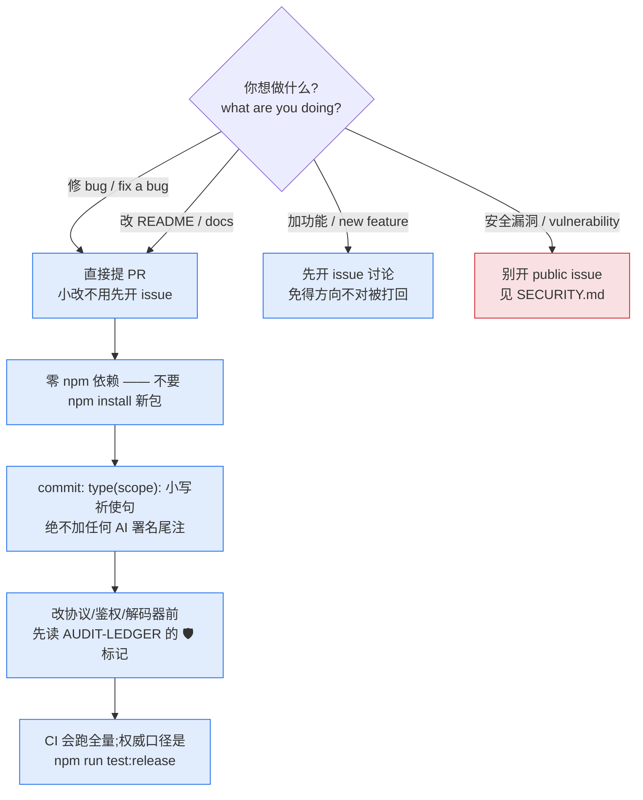

# 贡献指南 / Contributing

<p align="center">
  <a href="#简体中文">简体中文</a> ·
  <a href="#english">English</a> ·
  <a href="docs/AUDIT-LEDGER.md">审计台账</a> ·
  <a href="SECURITY.md">安全问题走这里</a>
</p>



感谢想贡献代码 / Thanks for wanting to contribute.

## 简体中文

### 开始之前

- 想加功能请先开 issue 讨论 免得撸完 PR 方向不对被打回
- 想修 bug 直接提 PR 就行 小改不用先开 issue
- 想改 README / docs 直接 PR
- 不清楚项目结构 看 [README](README.md) 的 "它到底在干嘛" 章节 和 `src/` 下每个文件顶部的注释

### 代码风格

- 项目是 **零 npm 依赖** 纯 `node:*` 内置模块 PR 里不要 `npm install` 新包
- 用 ES Modules (`import/export`) 和 async/await
- 缩进 2 空格 单引号 带分号
- 新文件放 `src/` 对应目录 命名和现有保持一致
- LS 协议相关改动（`windsurf.js` / `proto.js` / `grpc.js`）改字段号时 在 PR 描述里注明来源（参考 proto 文件 / 反编译发现等）
- Dashboard UI 不要用 `alert()` / `confirm()` / `prompt()` 用 `App.confirm()` / `App.prompt()`

### Commit & PR

- commit 格式 `type(scope): 简短说明`，scope 可选但推荐（写受影响的模块）。例：
  - `fix(auth,server): account-pool safety — bounded lockout map, id-based refcount`
  - `feat(devin-connect): tool_call nativization stage-0 — fix double-send, def-gate outer=10`
- type 只用：`feat` / `fix` / `refactor` / `perf` / `docs` / `test` / `chore` / `ci` / `revert`
- subject 全小写英文、祈使句、无句号；多个改动点用 `—`(em dash)接补充、`+` 连列
- 复杂改动写 body（bullet 列表）：每条 `文件: 改了什么（为什么/追溯标记）`，追溯标记如审计 ID(`PNG-1`)、审查缺口(`R2`/`O1`)、issue(`#192`)
- **调试日志不单独成 commit**（不要 `debug:` 类型）；调试代码在合并前清掉或并进功能 commit
- 一个 commit / 一个 PR 解决一件事，多件事按主题拆开
- **绝不在 commit message 里加任何 AI / 助手署名尾注**（`Co-Authored-By: Claude`、`Generated with…` 等一律不写）
- 标题写清楚改了啥，body 写为什么改，而不是怎么改（diff 自己会说）
- 本地启用 commit 模板：`git config commit.template .gitmessage`
- 可选：本地启用 hook，禁止直接在 master 上写 commit（流程是 分支 → 评审 →
  `git merge --ff-only` → 推）：`git config core.hooksPath .githooks`。
  它只挡 `git commit`，不挡 master 前进 —— `--ff-only` 不产生 commit，所以发版流程不受
  影响。刻意例外用 `git commit --no-verify`。
  值得装的理由：直接在 master 上提交产生的历史与 ff 合并**字节级相同**，所以事后看不出
  任何异常，只能在发生的那一刻挡。
  **作用范围（实测，别照直觉推）**：`git commit` 与 `--amend` 拦；`--ff-only` 放行；
  **`cherry-pick` / `revert` 拦不住** —— git 不在那条路径上调 pre-commit，两者都改由
  `post-commit` 事后警告（实测各自都会打印）；冲突的 merge/rebase 会触发，且给的是那个状态
  下**真能执行**的补救命令（`git switch -c` 在合并中会被 git 拒绝）。

### 测试

改动协议层 / 鉴权面 / 解码器前,先看 [docs/AUDIT-LEDGER.md](docs/AUDIT-LEDGER.md) —— 那里记了哪些子系统已被实际探测过、结论如何,以及哪些不变式有突变验证过的守卫。
碰到标 🛡 的地方,注意别把守卫住的性质改掉(例如给路由路径加 URL 解码、
或把 parseFields 改成自动递归)。

项目有完整的自动测试套件，PR 合并前 CI 会自动跑。权威计数口径是
`npm run test:release`（逐文件进程隔离）。**当前数字见
[最新交接文档](docs/README.md) 的门禁表，本文不复述** —— 这里此前钉着 v3.9.14 的
"3418 / 261"，而那之后又发了五个版本。一个数字写在不是它权威来源的地方就会烂。
全量 `npm test` 的总数**不再漂**：2026-09-13 实测，真正的原因不是"输出竞态"而是
`--test-force-exit` 会在跑完**部分 suite 之后**就让进程以 **0** 退出 —— 同一份字节跑 12 次得到
**8 个不同的数字（34…72）**，去掉它之后 **10/10 稳定**。该 flag 已从 `package.json`、
`scripts/run-test-shard.mjs` 与三个 harness 脚本中移除。**不要加回来**：
截断是静默的，而挂起会被 shard runner 点名。

**门禁全绿并不等于你没弄坏东西。** 测试套件**不跑**突变 spec（`test/mutations/*.json`），
所以如果你改的那一行正好是某条突变的 anchor，它会静默失配 —— 而你和 CI 都看不见。
PR #241 真发生过这件事：贡献者的套件全绿、维护者复测也全绿、合并后的门禁也全绿，
三个绿灯都没看见两条 anchor 已经断了。改了 `src/` 就顺手跑一次：

```bash
for s in test/mutations/*.json; do npm run mutate -- "$s"; done
```

它排他持有工作树（每步都在"写入 → 跑测试 → 还原"），跑起来之后别碰仓库。

提 PR 时建议在描述里补充：

- 跑了什么 curl 命令 / smoke 场景
- dashboard 哪个面板点了
- 复测了哪些模型（gpt-4o-mini 这类免费模型最方便）

### CI

GitHub Actions 跑 `npm run test:release`（语法校验 + 核心回归）。本地 `npm test` 跑全量。

---

## English

### Before you start

- Got a feature idea? Open an issue first so we can discuss direction.
- Fixing a bug? Just send the PR.
- README / docs changes? Just send the PR.
- Unclear about project structure? See [README](README.md) "What it does" section and the header comments in each `src/` file.

### Code style

- **Zero npm dependencies** — pure `node:*` builtins only. No `npm install` in PRs.
- ES Modules (`import/export`), async/await.
- 2-space indent, single quotes, semicolons.
- Put new files under `src/` in the matching directory. Follow existing naming.
- LS protocol changes (`windsurf.js` / `proto.js` / `grpc.js`): note the source of any new field numbers in the PR description.
- Dashboard UI: use `App.confirm()` / `App.prompt()` instead of native `alert()` / `confirm()` / `prompt()`.

### Commits & PRs

- Format: `type(scope): short description`. Scope optional but encouraged (the modules touched). e.g.
  - `fix(auth,server): account-pool safety — bounded lockout map, id-based refcount`
  - `feat(devin-connect): tool_call nativization stage-0 — fix double-send, def-gate outer=10`
- Types (only): `feat` / `fix` / `refactor` / `perf` / `docs` / `test` / `chore` / `ci` / `revert`.
- Subject: lowercase, imperative, no trailing period; join extra clauses with `—` (em dash), list items with `+`.
- Non-trivial changes get a body (bullet list): each line `file: what changed (why / trace tag)`, where a trace tag is an audit ID (`PNG-1`), review gap (`R2`/`O1`), or issue (`#192`).
- **Debug logging is never its own commit** (no `debug:` type); strip debug code before merge or fold it into the feature commit.
- One commit / one PR per concern. Split unrelated changes.
- **Never add any AI / assistant attribution trailer** to a commit message (`Co-Authored-By: Claude`, `Generated with…`, etc.).
- Title = what changed. Body = why (the diff speaks for how).
- Enable the commit template locally: `git config commit.template .gitmessage`
- Optional: enable the hook that refuses commits authored directly on master — the flow is
  branch → review → `git merge --ff-only` → push: `git config core.hooksPath .githooks`.
  It blocks `git commit` only, not master advancing (`--ff-only` creates no commit, so the
  release flow is untouched). Deliberate exception: `git commit --no-verify`.
  **Scope, measured — do not infer it**: `git commit` and `--amend` are blocked; `--ff-only`
  passes; **`cherry-pick` / `revert` are NOT blocked** (git never consults pre-commit there),
  so a companion `post-commit` hook warns after the fact for both — verified end to end for
  each route; a conflicted
  merge/rebase does fire, and prints recovery advice that actually works in that state
  (`git switch -c` is rejected by git mid-merge).
  Worth installing because committing straight to master yields history that is
  **byte-identical** to the ff-merge — nothing looks wrong afterwards, so the only useful
  moment to catch it is when it happens.

### Testing

Before touching the protocol layer, the auth surface or a decoder, read [docs/AUDIT-LEDGER.md](docs/AUDIT-LEDGER.md) — it records which subsystems have actually
been probed, what the conclusion was, and which invariants have mutation-verified guards.
Where you see 🛡, take care not to change the guarded property (e.g. adding URL decoding to
the routed path, or making parseFields recurse).

The project has a full automated test suite and CI runs it on every PR. The authoritative
count comes from `npm run test:release` (one process per file). **The current number lives in
the gate table of the newest handoff ([docs/README.md](docs/README.md) points at it) and is
deliberately not repeated here** — this spot used to pin "3418 / 261 as of v3.9.14" and five
releases shipped after that. A number written anywhere other than its authoritative source
rots. Totals from a plain `npm test` **no longer drift**: measured 2026-09-13, the cause was not
an "output race" but `--test-force-exit` ending the process after **part of the suites** and
still exiting **0** — twelve identical runs of one file gave **eight distinct counts (34..72)**,
and **10/10 stable** without it. The flag was removed from `package.json`,
`scripts/run-test-shard.mjs` and the three harness scripts. **Do not re-add it**: a truncation is
silent, a hang is named by the shard runner.

**A green gate does not mean you broke nothing.** The test suite does **not** run the mutation
specs (`test/mutations/*.json`), so if you edit a line one of them anchors on, the anchor
silently stops matching — invisibly to both you and CI. This really happened on PR #241: the
contributor's suite was green, the maintainer's re-run was green, and the post-merge gate was
green, and all three missed two broken anchors.

**Incremental gate (native Windows PowerShell or POSIX):**

```text
npm run gate
```

It runs spec-static-check, secret-scan, the unchanged test:release command, and whitespace
checks for both unstaged and staged changes. Every step prints PASS/FAIL and its exit code;
the release result includes explicit skips. Mutations print SKIP because they are not part
of this incremental command. Exit 0 is incremental success, 1 a failed check, 2 missing or
untrustworthy evidence. PR CI deliberately does not run mutations because of their cost.

**Full gate on Linux/POSIX** (Node, npm, Git and Bash installed; clean committed checkout):

```bash
set -eu
[ -z "$(git status --porcelain)" ] || { echo 'Commit changes before mutation validation'; exit 2; }
npm ci
npm run gate
set -- test/mutations/*.json
[ -f "$1" ] || { echo 'No mutation specs'; exit 2; }
expected=$#; completed=0; failed=0
for spec do
  code=0
  npm run mutate -- "$spec" || code=$?
  printf 'VERDICT %s exit=%s\n' "$spec" "$code"
  completed=$((completed + 1))
  if [ "$code" -ne 0 ]; then failed=1; fi
done
[ "$completed" -eq "$expected" ] || exit 2
printf 'VERDICT coverage: %s/%s\n' "$completed" "$expected"
[ "$failed" -eq 0 ]
```

**Full gate from Windows PowerShell:** run the incremental command natively, then run the
POSIX fixtures in a clean WSL Linux clone of the **same committed HEAD**. Do not add Git for
Windows paths to the trusted POSIX fixture candidates. WSL must already have Node, npm,
Git and Bash; this command does not install or silently substitute them. Native skips are
not mutation evidence. Keep both logs when reviewing a Windows-originated change.

```powershell
$ErrorActionPreference = 'Stop'
npm run gate
if ($LASTEXITCODE -ne 0) { exit $LASTEXITCODE }
if (git status --porcelain) { throw 'Commit changes before mutation validation' }
$owner = (git rev-parse --show-toplevel).Trim()
if ($LASTEXITCODE -ne 0) { throw 'Not a Git checkout' }
$commit = (git rev-parse HEAD).Trim()
$linuxOwner = (wsl -- wslpath -a -- $owner).Trim()
if ($LASTEXITCODE -ne 0) { throw 'WSL path conversion failed' }
$script = @'
set -eu
owner=$1; commit=$2
scratch=$(mktemp -d)
trap 'rm -rf "$scratch"' EXIT
# --no-local transfers Git objects rather than hard-linking across filesystems.
git -c core.autocrlf=false clone --no-local --quiet -- "$owner" "$scratch/repo"
cd "$scratch/repo"
git checkout --quiet --detach "$commit"
[ "$(git rev-parse HEAD)" = "$commit" ] || exit 2
npm ci
npm run gate
set -- test/mutations/*.json
[ -f "$1" ] || { echo 'No mutation specs'; exit 2; }
expected=$#; completed=0; failed=0
for spec do
  code=0
  npm run mutate -- "$spec" || code=$?
  printf 'VERDICT %s exit=%s\n' "$spec" "$code"
  completed=$((completed + 1))
  if [ "$code" -ne 0 ]; then failed=1; fi
done
[ "$completed" -eq "$expected" ] || exit 2
printf 'VERDICT coverage: %s/%s\n' "$completed" "$expected"
[ "$failed" -eq 0 ]
'@
$localScript = [IO.Path]::GetTempFileName()
try {
  [IO.File]::WriteAllText($localScript, ($script -replace "`r", ''), [Text.UTF8Encoding]::new($false))
  $linuxScript = (wsl -- wslpath -a -- $localScript).Trim()
  if ($LASTEXITCODE -ne 0) { throw 'WSL script path conversion failed' }
  wsl -- bash $linuxScript $linuxOwner $commit
  if ($LASTEXITCODE -ne 0) { throw "Linux full gate failed: exit=$LASTEXITCODE" }
} finally {
  Remove-Item -LiteralPath $localScript -Force
}
```

The mutation step holds its checkout exclusively (write, test, restore). Do not edit that
checkout while it runs. In your PR description, also include:

- What curl commands or smoke scenarios you ran
- Which dashboard panels you clicked through
- Which models you tested (free ones like `gpt-4o-mini` are easiest)

### CI

GitHub Actions runs `npm run test:release` (syntax + core regression). Run `npm test` locally for the full suite.
