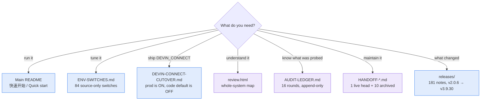

# WindsurfAPI Docs

  <a href="#-just-want-to-run-it">Run it</a> ·
  <a href="#-operating-it">Operate it</a> ·
  <a href="#-understand-the-internals">Internals</a> ·
  <a href="#-taking-this-project-over-read-these-three-in-this-order">Take it over</a> ·
  <a href="../README.md">← Main README</a>

> **Which door is yours?** This directory holds 203 tracked files, most of them append-only
> records aimed at whoever maintains the project next. The three tables below are the short
> paths in. If you only want the gateway running, you need nothing under "Take it over".

蓝 = 用户向 · 紫 = 维护者向 / blue = for users, purple = for maintainers

## 🚀 Just want to run it

| Goal | Go here |
|---|---|
| Install and send a first request | **[Main README → 快速开始](../README.md#快速开始)** |
| Point Claude Code / Cline / Cursor at it | [Main README → 客户端接入](../README.md#claude-code--cline--cursor-怎么用) |
| See which models are available | [Main README → 模型清单](../README.md) — the `/v1/models` endpoint is authoritative |

## 🔧 Operating it

| Goal | Go here |
|---|---|
| Tune behaviour without touching code | **[ENV-SWITCHES.md](ENV-SWITCHES.md)** — the 84 switches that exist only in source. Read its header first: it explains how to count them correctly, because the obvious `grep` undercounts by 70 |
| Take `DEVIN_CONNECT` to production | **[DEVIN-CONNECT-CUTOVER.md](DEVIN-CONNECT-CUTOVER.md)** — production runs with this ON while the code default is OFF, so this is not optional reading |
| Localise the dashboard | [dashboard-i18n.md](dashboard-i18n.md) |
| See what changed in a version | [releases/](releases/) — one file per version, v2.0.6 → present |

## 🔬 Understand the internals

| Goal | Go here |
|---|---|
| Get the whole map in one page | **[Architecture Review](review.html)** — startup → routes → protocol bridge → account/LS pools → dashboard → security boundaries |
| Know which subsystems were actually probed, and what the conclusion was | **[AUDIT-LEDGER.md](AUDIT-LEDGER.md)** — start with its `怎么读这份文件` section; the file is appended per round and is not organised by topic |
| Understand reasoning/content dedup | [reasoning-dedup.md](reasoning-dedup.md) |

---

## 🛠 Taking this project over? Read these three, in this order

| # | File | Why |
|---|---|---|
| 1 | **[HANDOFF-2026-08-20.md](HANDOFF-2026-08-20.md)** | Current state (v3.9.30), what to expose, what is blocked on someone else. Read §1 first (three operational traps), then §2 (public vs never-git). Product tag is v3.9.30; OTA follows the latest annotated tag, not later untagged SHAs. |
| 2 | **[AUDIT-LEDGER.md](AUDIT-LEDGER.md)** | Which subsystems were *actually probed*, the conclusion, and where the guard lives. Start with its "怎么读这份文件" section: the file is appended to per round and is **not** organised by topic, so that section is the only reliable entry point. It states its own round count and line-scale — **this row deliberately states neither**, because both belong to a file that grows every round, and the version of this row that did cite a round count went stale twice. |
| 3 | **[DEVIN-CONNECT-CUTOVER.md](DEVIN-CONNECT-CUTOVER.md)** | Production cutover runbook. `DEVIN_CONNECT` is what production actually runs (the code default is OFF; the deployment sets it), so this is not optional. Paid wire-calibration procedure in §8. |

Two sections are worth reading even though they sit in superseded files:

- **[HANDOFF-2026-08-04-B.md](HANDOFF-2026-08-04-B.md) §5** — the best single section in these
  docs. §5.1 ("fixes themselves need a review pass") is why that round found six defects in
  its own repairs.
- **[HANDOFF-2026-08-04-E.md](HANDOFF-2026-08-04-E.md) §5.1** — a *correction* written into the
  audit ledger that was itself wrong. Worse than a wrong claim, because a correction makes the
  next reader stop doubting that spot. Its §7 is the companion piece: a later round put a
  *second* wrong number into the very passage that was fixing the first two.

### The rest of the handoffs are archive

Newest first. All ten archived files carry a banner naming the current handoff **and** a link back to this
index, so whichever one you open by accident, you are two clicks from the right place. That is
worth keeping: **`ls docs/` does not sort chronologically** — `-B.md` sorts before `.md` (so the
original `08-04` sorts *after* B/C/D/E), and `HANDOFF-2026-08-05.md` has a wrong filename date
(the work was 08-04, it covers v3.9.12, and it is the fifth-oldest despite sorting last).
Trust this list, not the directory listing.

| Handoff | Covers |
|---|---|
| [08-06](HANDOFF-2026-08-06.md) | v3.9.20 — Gemini tool-args, then the live head moved here |
| [08-04-E](HANDOFF-2026-08-04-E.md) | v3.9.17–v3.9.19 — PR #241 merged, the digest ceiling and its missing half, the post-release fan-out review |
| [08-04-D](HANDOFF-2026-08-04-D.md) | v3.9.15 — #234's last criterion, Cascade stream spend, CI node24 |
| [08-04-C](HANDOFF-2026-08-04-C.md) | v3.9.14 — #240 budget split |
| [08-04-B](HANDOFF-2026-08-04-B.md) | v3.9.13 — caller-shard fix, `npm run mutate`, git hooks |
| [08-05](HANDOFF-2026-08-05.md) | v3.9.12 — queue-on-pin (**misdated filename**) |
| [08-04](HANDOFF-2026-08-04.md) | v3.9.9–v3.9.11 — its §3 corrects four earlier claims |
| [08-03-B](HANDOFF-2026-08-03-B.md) | v3.9.8 |
| [08-03](HANDOFF-2026-08-03.md) | the first #234 analysis |
| [07-27](HANDOFF-2026-07-27.md) | v3.9.0–v3.9.6 |

Handoffs are **append-only**: a superseded one keeps its original conclusions, wrong ones
included, because how a conclusion was reached is part of the record. For current state, the
newest always wins.

## Verification tooling

The test suite does **not** run the mutation specs, so three gates can be green while a spec
silently stopped guarding. These are the tools that close that gap:

- `scripts/spec-static-check.mjs` — **0.3s, runs in CI on every PR.** Anchor uniqueness + spec
  well-formedness, no test execution. Catches a PR that edited a pinned line (the mutation
  becomes a no-op that reports SURVIVED). Exit 2 on failure.
- `scripts/spec-baseline-audit.mjs [filter]` — **re-measures every spec's `expectBaselinePass`
  by actually running its test files** (slow; ~40 min for all 25). Run after merges, not per-PR.
  Baseline drift is a merge product: each PR measures its own spec right alone, and is wrong
  once stacked (#241 anchors, retry-rescue 82/87→88, reasoning-continuity 289→300).
- `test/default-on-switch-registry.test.js` — ledger of every default-on behaviour switch;
  each must have an off-path test or a recorded waiver. A default-on switch shipping without a
  ledger entry fails CI. Added after #247 shipped as the sole default-on change in a batch with
  no kill switch and a content-loss failure shape.
- `scripts/secret-scan.mjs` — now scans `test/` too (fixtures exempt by SHAPE, not path).
  Round 12 measured ~1100 of ~2333 new lines were never scanned.

## Protocol and product notes

- [Architecture Review](review.html): project map from startup to HTTP routes, protocol bridge,
  account/LS pools, dashboard, security boundaries, tests, and core runtime behavior.
- [Dashboard i18n](dashboard-i18n.md): dashboard localization notes.

## Release history

- [releases/](releases/): one file per version, v2.0.6 → present. Append-only published
  history — each file is a GitHub Release body.
- **[releases/README.md](releases/README.md) is the release runbook** — the ordered
  procedure, the gate, and the house style for writing notes all live there, next to the
  task, rather than being summarised here. Read it before shipping anything: the version
  it replaced would have failed at step 3, because it told you to commit on `master`
  and the pre-commit hook refuses that.

## Generated output

- [index.html](index.html): GitHub Pages static output. Do **not** treat it as the canonical
  source for operational status.
- [review.html](review.html): the public architecture review page.

## Conventions for this directory

- **Untracked internal docs live in `docs-internal/`** (git-ignored): AI session records,
  scratch analysis, workflow output. Everything in `docs/` is written for an outside reader.
- **Every claim in a doc must be verifiable.** This repo has repeatedly been bitten by
  "a comment explains design intent, not current fact" — before writing "on by default", read
  the default out of the code; before writing "called on X", grep for the call site.
- **A *correction* to an existing doc needs a HIGHER evidence bar than a new claim, not a
  lower one.** A new claim gets audited next round; "I checked, and what the last round wrote
  is false" makes the next reader *stop* doubting that spot. One such correction has already
  been wrong (audit ledger round 12): two greps both hit the right file, and the conclusion was
  drawn from the matching lines without opening it. Before correcting, open the file.
- **One handoff per RELEASE, not per session.** Five handoffs were written on 2026-08-04 alone,
  each superseding the last, and the result is a directory whose filename order is not
  chronological and eight files that need banners to say "not this one". Amending the current
  handoff in place is fine and preferred while its version is still unreleased; start a new
  file once a tag ships. Numbers inside a handoff (gate counts, mutation totals, file counts)
  must be re-measured when it is amended — they are the fastest thing in these docs to rot.
- **Don't cite a section by number without opening it.** `§5.2` in a file you last read three
  rounds ago is a citation, and citations here are held to the same standard as `file:line`.
